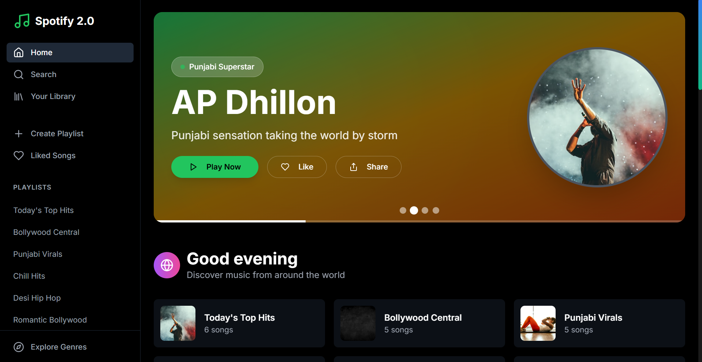

<div align="center">

# 🎵 Spotify 2.0 Clone
**_Your Next-Gen Music Streaming Experience_**

[](https://nextjs.org/)
[](https://tailwindcss.com/)
[](https://zustand-bear.github.io/zustand/)
[](https://www.typescriptlang.org/)

🎧 A complete, responsive, and dynamic music streaming app replicating Spotify's core features with enhanced UI/UX.
✨ Built with Next.js 14, Tailwind CSS, and Zustand for a seamless experience.

[🚀 Live Demo](https://spotify-2-0-jade.vercel.app/) • [📚 Docs](https://github.com/Jat21in/Spotify-2.0/) • [🐛 Report Bug](https://github.com/Jat21in/Spotify-2.0/)



</div>

---

## 🌟 About Spotify 2.0 Clone

**Spotify 2.0 Clone** is a modern, full-featured music streaming web application designed to mimic and improve upon the core functionalities of Spotify. It's built with **Next.js 14** using the App Router, styled with **Tailwind CSS**, and manages global music state with **Zustand**. Enjoy a responsive, dark-themed interface with persistent playback and real-time search.

---

## 🚀 Features

### Core Functionality
- **Homepage**: Discover featured playlists, new releases, and trending albums.
- **Search**: Real-time search with intelligent suggestions and categorized results across songs, artists, albums, and playlists.
- **Playlists**: Comprehensive playlist management, including cover art and metadata display.
- **Genre Exploration**: Browse and discover music by various genres with curated playlists.
- **Library**: Your personal music hub, featuring liked songs and all your created playlists.

---

### 🎶 Player Features
- **Persistent Player**: A seamless bottom music player that stays active across all routes.
- **Full Controls**: Intuitive play/pause, previous/next, shuffle, and repeat controls.
- **Progress & Volume**: Interactive progress bar with scrubbing and volume control with mute toggle.
- **Queue Management**: Dynamic queue management and autoplay functionality for continuous listening.

---

### 🎨 UI/UX & Accessibility
- **Dark Theme**: A sleek, Spotify-inspired dark theme for an immersive visual experience.
- **Fully Responsive**: Optimized for mobile, tablet, and desktop with smooth transitions.
- **Smooth Animations**: Engaging animations and hover effects for a delightful user experience.
- **Robust Feedback**: Clear loading states and error handling for a reliable application.
- **Accessible**: Semantic HTML, ARIA labels, keyboard navigation, and high contrast support.

---

## 🛠 Tech Stack

| Category        | Technology             | Purpose                                                                     |
|-----------------|------------------------|-----------------------------------------------------------------------------|
| 🚀 Framework    | Next.js 14 (App Router)| React framework for production-grade apps                                   |
| 🎨 Styling      | Tailwind CSS, shadcn/ui| Utility-first CSS framework for custom & ready-made UI components           |
| 🧠 State Mgmt   | Zustand                | Lightweight and flexible state management for global music state            |
| 🖼️ Icons        | Lucide React           | Beautiful and customizable open-source icons                                |
| 🔊 Audio        | HTML5 Audio API        | Native browser API for robust audio playback                                |
| 🛡️ Type Safety   | TypeScript             | Enhanced code quality and developer experience with static typing           |
| 🪄 Animations   | Framer Motion (planned)| Smooth and declarative animations for UI elements (future enhancement)      |

---

## 🚀 Getting Started

Follow these steps to get your development environment set up:

1.  **Clone the repository:**
    ```bash
    git clone <repository-url>
    cd spotify-clone
    ```

2.  **Install dependencies:**
    ```bash
    npm install
    ```

3.  **Run the development server:**
    ```bash
    npm run dev
    ```

4.  **Open your browser:**
    Navigate to `http://localhost:3000` to see the application in action.

---

## 🎨 Customization & Enhancements

### Adding Real Music API
Currently, the application uses mock data for demonstration. To integrate with real music services:

-   Replace the mock data in `lib/api.ts` with actual API calls.
-   Consider using APIs like **Deezer API**, **Spotify Web API**, **JioSaavn API**, or **Last.fm API**.

### Theming
Tailor the look and feel of the application:
-   Modify `app/globals.css` for global styles.
-   Adjust `tailwind.config.js` for theme configuration and custom palettes.
-   Style individual components for specific visual tweaks.

### Adding Features
Expand the application's capabilities:
-   Implement user authentication (e.g., Firebase, Auth0).
-   Add full playlist creation and advanced management features.
-   Integrate social features like following users or sharing music.
-   Explore advanced audio features such as an equalizer or crossfade.

---

## 🚀 Deployment

This application is optimized for deployment on modern platforms:
-   **Vercel** (highly recommended for Next.js projects)
-   **Netlify**
-   **AWS Amplify**
-   **Docker containers**

### Environment Setup

For development, the project works out-of-the-box with mock data. When integrating real APIs, remember to:
1.  Create a `.env.local` file in the root directory.
2.  Add your API credentials to this file (consult the specific API documentation for required keys).
3.  Update the functions in `lib/api.ts` to utilize these real API endpoints.

---

## 🤝 Contributing

We welcome contributions! To get started:
1.  Fork the repository.
2.  Create a new feature branch (`git checkout -b feature/your-feature-name`).
3.  Make your changes and ensure they adhere to existing code styles.
4.  Add tests if applicable to cover new functionalities.
5.  Submit a pull request with a clear description of your changes.

---

## 📄 License

This project is licensed under the MIT License - see the [LICENSE](LICENSE) file for details.

## 🙏 Acknowledgments

<div align="center">

**Built with dedication and a passion for music.**

Special thanks to:
 🌟 Spotify for being the ultimate design inspiration.
 🎨 shadcn/ui for providing an excellent foundation of beautiful components.
 ⚛️ The Next.js team for creating such a powerful and versatile framework.
 ☁️ Vercel for their seamless hosting and deployment tools.

---

<sub>Made with ❤️ and 🎶 by JATIN MITTAL who believes music makes the world go 'round</sub>

**[⭐ Star this repo](https://github.com/Jat21in/Spotify-2.0/)** • **[🐛 Report Bug](https://github.com/yourrepo/spotify-clone/issues)** • **[💡 Request Feature](https://github.com/yourrepo/spotify-clone/issues)**

</div>
